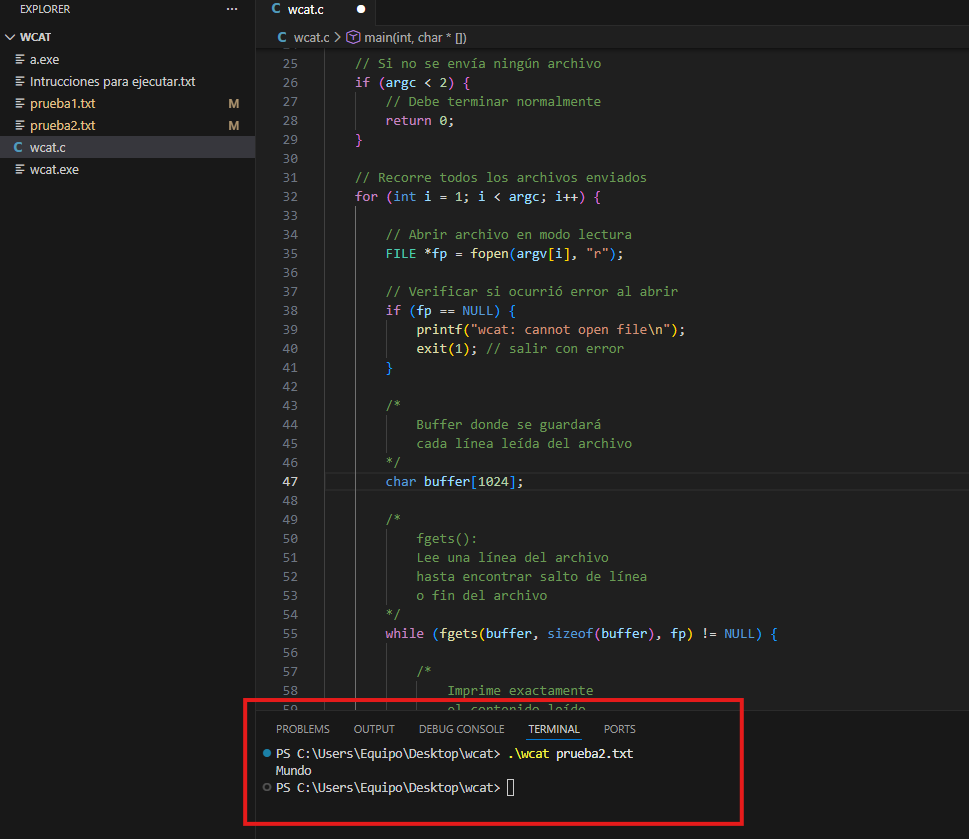
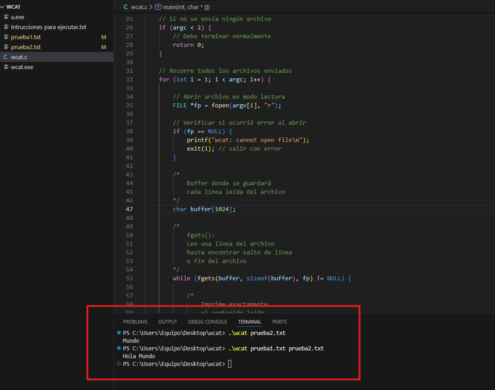
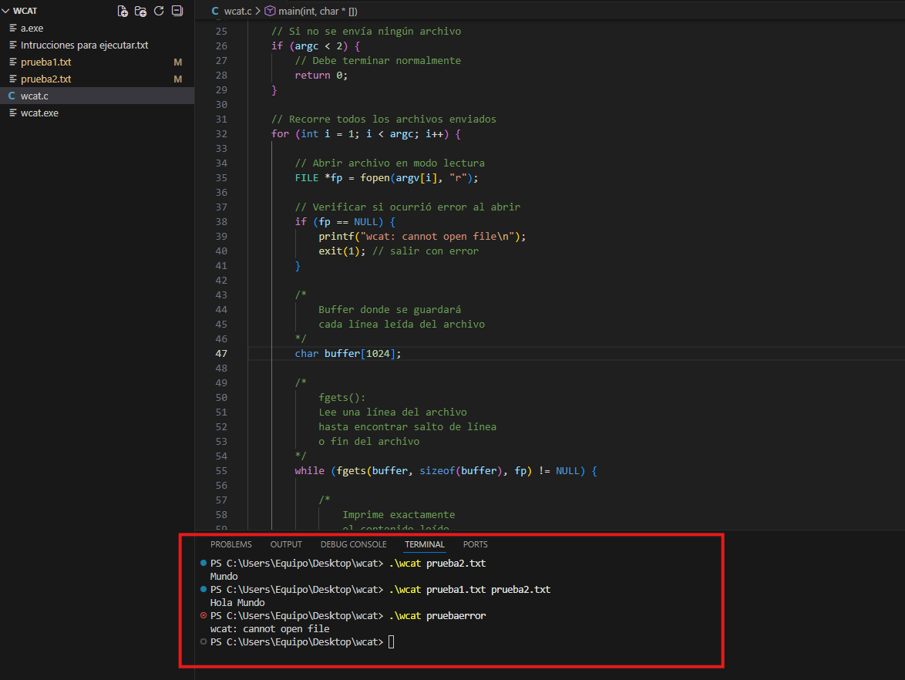
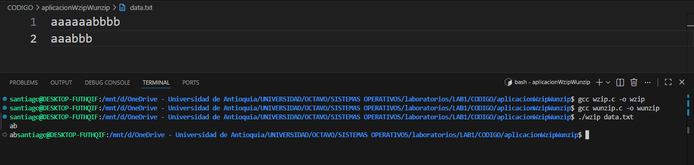
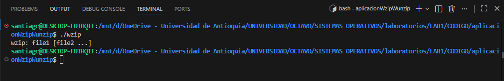
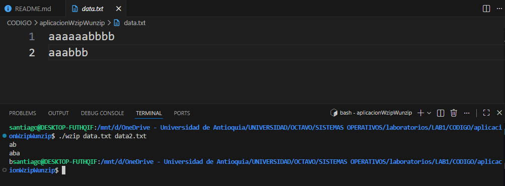
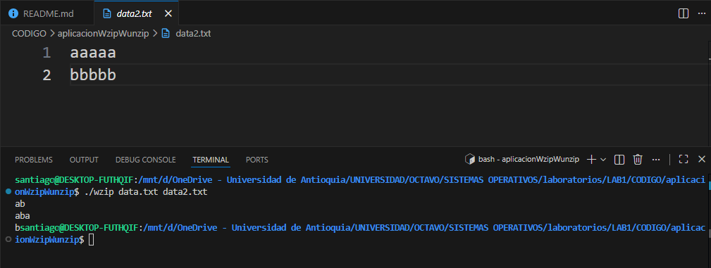
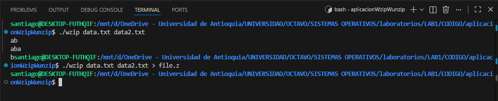
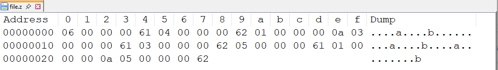
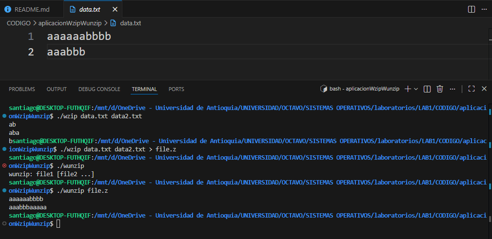

# practica1-lenguajeC

## (a) Nombres completos de los integrantes, correos y n´umeros de documento.

### Santiago Jiménez Escobar - santiago.jimeneze@udea.edu.co - C.C 1036959331
### Emiro Moreno Soto - emiro.morenos@udea.edu.co - C.C 1001547311

## (b) Documentación de todas las funciones desarrolladas en el código.

# AplicacionWcat

- El programa inicia en la función main(int argc, char *argv[]), la cual permite obtener el número de argumentos ingresados y los nombres de los archivos enviados por línea de comandos. Inicialmente se verifica si no se ingresaron archivos mediante la condición if(argc < 2); en este caso, el programa simplemente termina su ejecución retornando 0, lo que indica una finalización correcta.

Posteriormente, se utiliza un ciclo for para recorrer cada uno de los archivos ingresados como argumentos. Para cada archivo, el programa intenta abrirlo en modo lectura utilizando la función fopen(). Si el archivo no puede abrirse, se muestra el mensaje "wcat: cannot open file" y el programa termina su ejecución utilizando exit(1), indicando que ocurrió un error.

Si el archivo se abre correctamente, el programa procede a leer su contenido línea por línea utilizando la función fgets(), almacenando temporalmente cada línea en un buffer de memoria. Cada línea leída es mostrada en pantalla mediante la función printf(), respetando el contenido original del archivo.

Finalmente, después de leer completamente cada archivo, se utiliza la función fclose() para cerrarlo y liberar los recursos utilizados. Una vez todos los archivos han sido procesados correctamente, el programa finaliza retornando 0, indicando una ejecución exitosa.

# AplicacionWgrep

- Se empieza utilizando la función **`main(int argc, char *argv[])`** la cual nos permite obtener la cantidad de argumentos y sus respectivos valores en un vector; posteriormente, si se ingresó un solo argumento correspondiente al nombre del archivo mediante el condicional **`if(argc==1)`** o si ingreso el nombre del archivo y el termino buscado mediante condicional **`else if(argc==2)`** en este caso se inician las variables necesarias para guardar el termino buscado y la linea que se imprimira por pantalla.

- Posteriormente se utiliza un ciclo **`while(getline(&linea, &tamaño, stdin) != -1)`** el cual se encarga de verificar los caracteres ingresados por teclado, y la funcion **`getline(&linea, &tamaño, stdin)`** se encargara de guardar esos caracteres en una linea en memoria, luego con la siguiente funcion **`strstr(linea, terminoBuscado)`** se verifica si el termino buscado se encuentra dentro de la linea en memoria y si es correcto se imprime la linea completa en pantalla, y se libera de memoria la información de la linea y hacer una salida exitosa.

- La siguiente parte consiste en inicializar el término buscado y realizar la iteración para cada uno de los archivos pasados mediante el ciclo **`for(int i=2; i<argc; i++)`**. Con esto se abre cada archivo en modo lectura; en caso de no poderse abrir, muestra el mensaje en pantalla y hace la salida no exitosa.

- Luego se crea la variable donde se guardará la línea que se extraerá del archivo y se inicia el ciclo **`while (getline(&linea, &tamaño, f) != -1)`** el cual se encarga de ejecutar mientras obtenga líneas del archivo abierto; luego, con la función **`getline(&linea, &tamaño, f)`** se trae la línea en cuestión.

- Con la función **`strstr(linea, terminoBuscado)`** se verifica si el término buscado está dentro de la línea, y en caso afirmativo, se imprime en pantalla el contenido completo de dicha línea mediante **`printf("%s", linea)`**, por último, se libera el espacio en memoria y se cierra el archivo mediante las funciones **`free(linea)`** y **`fclose(f)`**.

# AplicacionWzipWunzip

- La funcion  **`main(int argc, char *argv[])`** se utiliza en ambas aplicaciones wzip y Wunzip con el fin de inicializar la aplicación y obtener el número de argumentos y el valor de los argumentos ingresados por consola cuando se ejecuta la aplicación.

- Para verificar si se ingresó un número de argumentos acorde a lo que se pide en la práctica, se utiliza el condicional **`if (argc < 2)`** en caso de que el contador de argumentos sea menor a 2, se imprime por pantalla la forma correcta en la cual se deben ingresar estos argumentos.

- El ciclo principal **`for (int i = 1; i < argc; i++)`** permite iterar para cada uno de los argumentos ingresados; en este caso, al utilizar la funcion **`fopen(argv[i], "r")`** estamos abriendo cada uno de los archivos en modo lectura que se pasaron en la línea de comandos. En caso de no poderse abrir el archivo **`if (!f)`** muestra el mensaje de error en pantalla y pasa al siguiente archivo.

- Posteriormente, se inicializan las variables **Prev**, **c** y **count** las cuales guardarán el carácter anterior, el siguiente y el número de veces que se repite, esto con ayuda de la función **`fgetc(f)`** que nos permite obtener el primer carácter del archivo abierto.

- Antes de realizar el primer conteo, se verifica con el condicional **`if (prev == EOF)`** si no hay ningún carácter en el archivo; en este caso, se cierra dicho archivo con la función **`fclose(f);`** y se continúa con el siguiente.

- Lo siguiente por hacer es leer cada uno de los caracteres que hay en el archivo; para ello utilizamos el ciclo **`while ((c = fgetc(f)) != EOF)`**. Mientras cargamos cada carácter, verificamos si el carácter leído es igual al anterior mediante el condicional if **`if (c == prev)`** y si es afirmativo, incrementamos el contador.

- En caso contrario, se escribe en la salida el número de repeticiones y el carácter en cuestión mediante la función **`fwrite(&count, sizeof(int), 1, stdout)`** y **`fwrite(&prev, sizeof(char), 1, stdout)`**. Por último, se cierra el archivo actual mediante la función **`fclose(f)`**.

- Para el caso de la descompresión, iteramos cada uno de los archivos que sean pasados por la línea de comandos mediante un ciclo for **`for (int i = 1; i < argc; i++)`** se abre el archivo en modo lectura de binario, ya que el archivo fue comprimido en ese formato. Si el archivo no se puede abrir, lo verificamos mediante el condicional **`if (!f)`** o, en caso contrario, se crean las variables que representarán la cantidad de caracteres y el carácter en cuestión.

- El algoritmo de descompresion consta de un ciclo while **`while (fread(&count, sizeof(int), 1, f) == 1)`** el cual a su vez tiene incluida otra funcion **`fread(&count, sizeof(int), 1, f)`**, el ciclo while se ejecutara mientras alla elementos en el archivo para leer, mientras que la funcion **`fread()`** se encargara de ir leyendo cada uno de los enteros de archivo, posterior a ello se incluye otra funcion **`fread(&c, sizeof(char), 1, f)`** la cual se encarga de ir leyendo el caracter asociado a la siguiente posicion del entero. Con esto se recorre un ciclo for para ir imprimiendo la descompresión en pantalla.

## (c) Problemas presentados durante el desarrollo de la pr´actica y sus soluciones.

1.  Uno de los principales problemas fue entender la forma en la que trabaja el lenguaje C, ya que veníamos de unos lenguajes de muy alto nivel o de muy bajo nivel, pero en este caso es un nivel intermedio en el cual es necesario combinar ambos conceptos. La solución a esta situación no viene de una implementación en concreto, sino más bien de la práctica y el uso constante del lenguaje.

2. Otra situación que se presentó fue durante el desarrollo de la aplicación Wzip, específicamente en el caso en que solo se ingresaba el nombre del programa y el archivo a comprimir. En este escenario, se esperaba que el contenido del archivo comprimido se mostrara en pantalla; sin embargo, lo que se obtenía era un texto que aparentemente no correspondía al resultado esperado.

    La solución surgió a partir de la investigación y la comprensión del proceso de compresión. Se identificó que la primera parte del archivo comprimido correspondía a un entero de 4 bytes almacenado en formato binario. Debido a esto, al imprimirse directamente en pantalla, se mostraban caracteres que no eran legibles como texto convencional. Por lo tanto, se concluyó que este comportamiento no era un error, sino una consecuencia normal de cómo se estaban representando los datos en binario dentro del proceso de compresión.

## (d) Pruebas realizadas a los programas que verificaron su funcionalidad.

# AplicacionWcat
A continuación se observa la ejecución de la aplicación Wcat, mostrando la lectura de uno o varios archivos, así como el comportamiento del programa cuando no se ingresan argumentos o cuando ocurre un error al abrir un archivo

# AplicacionWzipWunzip

A continuación se observa la ejecución de la aplicación WinZip, en la cual se tiene en cuenta el mensaje de salida cuando solo se ingresa un solo término, cuando se ingresa 1 más archivos de búsqueda, al igual que el resultado de la descompresión.

## (e) Un enlace a un video de 10 minutos donde se sustente el desarrollo.
## (f) Manifiesto de transparencia: En que puntos se apoyaron de la IA generativa.
